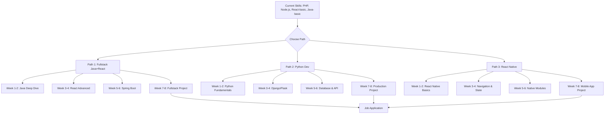

# Learning Path for 2nd Job (2 Months)

## Current Skills Analysis
- **PHP**: Strong
- **Node.js**: Strong
- **React**: Basic
- **Java**: Basic
- **Available Time**: 2 hours/night = ~120 hours total (60 days)

## Recommended Path Ranking

### 🥇 #1 RECOMMENDED: Fullstack (Java, ReactJs)
**Why**: Leverages your existing basic Java and React skills. Most achievable in 2 months.

### 🥈 #2 ALTERNATIVE: Python Dev
**Why**: Node.js experience makes Python transition easy. High demand.

### 🥉 #3 ALTERNATIVE: React Native
**Why**: Builds on your basic React. Mobile development is lucrative.

---

## Learning Path Flow Diagram



---

## Detailed Learning Path: Fullstack (Java, ReactJs) - 8 Weeks

### Week 1-2: Java Deep Dive (20 hours)
**Goal**: Solidify Java fundamentals to intermediate level

**Daily Schedule (2 hours/night, Mon-Fri)**:
- **Mon-Wed**: Core Java concepts
  - OOP principles (inheritance, polymorphism, encapsulation)
  - Collections Framework (List, Set, Map)
  - Exception handling
- **Thu-Fri**: Java 8+ features
  - Lambdas & Streams
  - Optional class
  - Functional interfaces

**Weekend (4 hours each)**:
- **Week 1**: Build console applications
- **Week 2**: Practice LeetCode easy/medium Java problems

**Resources**:
- [Oracle Java Tutorials](https://docs.oracle.com/javase/tutorial/)
- [Java 8 in Action](https://www.manning.com/books/java-8-in-action)
- LeetCode Java practice (5 problems/day)

---

### Week 3-4: React Advanced (20 hours)
**Goal**: Move from basic to production-ready React

**Daily Schedule**:
- **Mon-Wed**: React patterns
  - Hooks deep dive (useEffect, useMemo, useCallback, custom hooks)
  - Context API for state management
  - React Router v6
- **Thu-Fri**: Ecosystem
  - Redux Toolkit
  - React Query for data fetching
  - Testing with Jest + React Testing Library

**Weekend Projects**:
- **Week 3**: Build a dashboard with charts
- **Week 4**: Add authentication, pagination, filters

**Resources**:
- [React Official Docs](https://react.dev/)
- [Redux Toolkit Tutorial](https://redux-toolkit.js.org/tutorials/essentials/part-1-overview-concepts)
- [React Query Docs](https://tanstack.com/query/latest)

---

### Week 5-6: Spring Boot (20 hours)
**Goal**: Build production-ready backend APIs

**Daily Schedule**:
- **Mon-Wed**: Spring Boot fundamentals
  - REST APIs with Spring Web
  - Spring Data JPA + Hibernate
  - Validation & Exception handling
- **Thu-Fri**: Advanced topics
  - Spring Security (JWT auth)
  - Docker containerization
  - Testing with JUnit 5

**Weekend Projects**:
- **Week 5**: Build REST API with CRUD operations
- **Week 6**: Add auth, database migrations, Docker setup

**Resources**:
- [Spring Boot Official Guide](https://spring.io/guides/gs/spring-boot/)
- [Baeldung Spring Tutorials](https://www.baeldung.com/spring-boot)
- [Amigoscode YouTube](https://www.youtube.com/c/amigoscode)

---

### Week 7-8: Fullstack Project (20 hours)
**Goal**: Build portfolio-ready application

**Project Idea**: Task Management System
- **Frontend**: React + Redux Toolkit + React Router
- **Backend**: Spring Boot + PostgreSQL + JWT Auth
- **DevOps**: Docker + GitHub Actions

**Week 7**: 
- Set up project structure
- Implement authentication
- Build core features

**Week 8**:
- Add advanced features (file upload, notifications)
- Write tests
- Deploy to render/railway/free tier
- Document in README

---

## Alternative Path: Python Dev - 8 Weeks

### Week 1-2: Python Fundamentals (20 hours)
- Syntax, data structures, OOP
- Decorators, generators, context managers
- Virtual environments, pip

### Week 3-4: Django/Flask (20 hours)
- Django ORM, views, templates
- REST framework for APIs
- Flask for lightweight apps

### Week 5-6: Database & Advanced Topics (20 hours)
- PostgreSQL with SQLAlchemy
- Redis for caching
- Celery for background tasks
- Testing with pytest

### Week 7-8: Production Project (20 hours)
- Build full CRUD application
- Add authentication
- Deploy to Heroku/Railway
- Write comprehensive tests

---

## Alternative Path: React Native - 8 Weeks

### Week 1-2: React Native Basics (20 hours)
- Setup (Expo vs CLI)
- Core components
- Styling with Flexbox
- Navigation

### Week 3-4: State & Data (20 hours)
- Context API
- Redux Toolkit
- React Query
- AsyncStorage

### Week 5-6: Native Features (20 hours)
- Camera, Location, Notifications
- Native modules
- Push notifications
- Deep linking

### Week 7-8: Mobile App Project (20 hours)
- Build complete mobile app
- Add animations
- Test on iOS/Android
- Deploy to app stores

---

## Learning Resources

### Free Resources
- **YouTube Channels**:
  - Traversy Media (web dev)
  - Programming with Mosh (Java, Python)
  - Amigoscode (Spring Boot)
  - Net Ninja (React, Django)
  - Fireship (quick concepts)

- **Interactive Platforms**:
  - freeCodeCamp (web dev)
  - Codecademy (basic courses)
  - Educative.io (text-based)
  - Exercism (practice problems)

- **Documentation**:
  - Official docs are always best
  - Read source code of open source projects

### Paid Resources (Optional)
- **Udemy**: Look for courses on sale ($10-15)
  - "Spring Boot Masterclass"
  - "Complete React Developer"
  - "Python for Everybody"
- **Pluralsight**: If company provides
- **Coursera**: Specialized tracks

---

## Preparation Kit

### 1. CV Update

**Structure**:
```
Name
Contact: Email | LinkedIn | GitHub | Portfolio

SUMMARY
[2-3 lines highlighting your transition and new skills]

EXPERIENCE
[Current Job] - [Dates]
- Bullet points highlighting PHP/Node.js work
- Add: "Transitioning to Fullstack Java+React"

PROJECTS
[Portfolio Project] - [Dates]
- Tech stack: Java, Spring Boot, React, PostgreSQL
- Built [feature], achieved [result]
- Link to GitHub repo and live demo

SKILLS
Languages: Java, Python, JavaScript, PHP
Frameworks: Spring Boot, React, Django
Tools: Git, Docker, PostgreSQL
```

**Tips**:
- Quantify achievements (improved X by Y%)
- Tailor to each job application
- Include GitHub link with active contributions
- Add LinkedIn with recommendations

---

### 2. Practice Routine

**Daily (1 hour)**:
- LeetCode/CodeSignal: 2 problems (1 easy, 1 medium)
- System design: Read 1 design article
- Tech news: Read 2 articles from Hacker News

**Weekly (3 hours)**:
- Build 1 small feature/mini-project
- Write blog post about what learned
- Update GitHub with commits

**Mock Interviews**:
- Practice with Pramp (free)
- Record yourself answering questions
- Use Interviewing.io for practice

---

### 3. Pet Projects (Choose 2-3)

**Project 1: E-commerce API**
- Tech: Spring Boot, PostgreSQL, JWT
- Features: Products, cart, orders, payments
- Deploy: Railway/Render

**Project 2: Real-time Dashboard**
- Tech: React, WebSocket, Chart.js
- Features: Live data visualization, filters
- Deploy: Vercel

**Project 3: Task Manager**
- Tech: Fullstack Java+React
- Features: CRUD, auth, file upload
- Deploy: Docker + Cloud

**Project Requirements**:
- Clean code with proper structure
- Unit tests (70%+ coverage)
- Dockerfile included
- Comprehensive README
- Live demo deployed
- API documentation (Swagger)

---

### 4. Interview Preparation

**Technical Topics to Master**:
- **Java**: OOP, Collections, Streams, Concurrency basics
- **React**: Hooks, State Management, Performance
- **Spring Boot**: Dependency Injection, REST, Security
- **Database**: SQL basics, indexing, transactions
- **System Design**: Scalability, Caching, Load Balancing

**Behavioral Questions (STAR Method)**:
- Tell me about a challenging bug you fixed
- How do you handle tight deadlines?
- Describe a time you learned a new technology quickly

**Whiteboarding Practice**:
- Array/String problems
- Tree/Graph traversals
- Design patterns (Singleton, Factory, Observer)

---

## Timeline Summary

| Week | Focus | Hours | Deliverable |
|------|-------|-------|-------------|
| 1-2 | Java Deep Dive | 20 | Console apps, LeetCode practice |
| 3-4 | React Advanced | 20 | Dashboard with charts |
| 5-6 | Spring Boot | 20 | REST API with auth |
| 7-8 | Fullstack Project | 20 | Portfolio app deployed |

**Total**: 120 hours (2 hours × 60 nights)

---

## Success Tips

1. **Consistency > Intensity**: Study 2 hours every night, not 10 hours on weekends
2. **Build, Don't Just Watch**: Code along with tutorials, then modify
3. **GitHub Activity**: Commit daily to show consistency
4. **Network Early**: Join Discord/Slack communities, ask questions
5. **Apply Early**: Start applying after week 4, even if not fully ready
6. **Learn by Teaching**: Explain concepts to others (blog, videos)
7. **Focus on Fundamentals**: Don't chase every new framework
8. **Read Production Code**: Study open source projects on GitHub

---

## Job Application Strategy

### Week 4: Start Applying
- Update LinkedIn profile
- Apply to 5-10 jobs/week
- Focus on junior/mid-level roles

### Week 6: Intensive Application
- Apply to 15-20 jobs/week
- Reach out to recruiters
- Ask for referrals

### Week 8: Interview Prep
- Schedule mock interviews
- Practice whiteboarding
- Prepare portfolio presentation

---

## Recommended Tools

- **Code Editor**: VS Code or IntelliJ IDEA
- **Version Control**: Git + GitHub
- **API Testing**: Postman
- **Database**: DBeaver or pgAdmin
- **Design**: Figma (for UI mockups)
- **Deployment**: Railway, Render, Vercel (free tiers)

---

## Final Notes

**Most Realistic Path**: Fullstack (Java, ReactJs)
- Leverages existing skills
- High demand in market
- Achievable in 2 months with consistent effort

**Backup Plan**: If Java path feels too steep, pivot to Python Dev
- Easier transition from Node.js
- Many job opportunities
- Shorter learning curve

**Key to Success**: 
- Build real projects, not just tutorials
- Deploy everything to show you can ship
- Network and apply early
- Stay consistent with daily practice

Good luck! You can do this. 🚀
